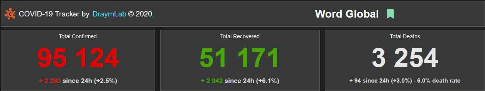
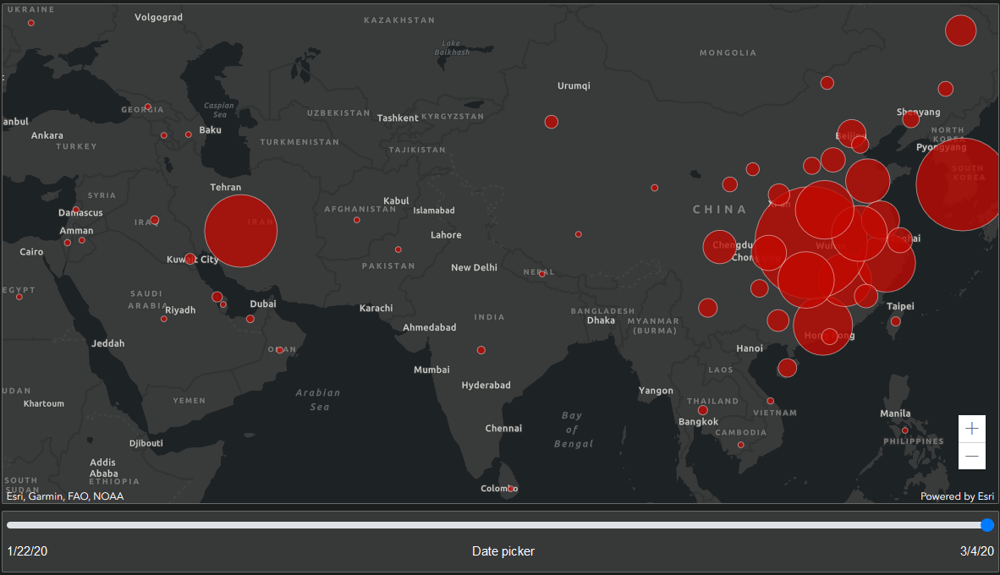
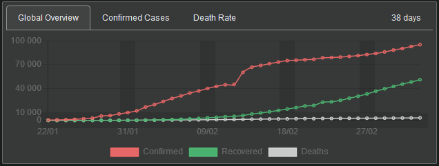

# Covid19 Tracker - [now online](http://covid19.draymlab.fr/)

Dashboard to track the cases of the Coronavirus COVID-19 worldwide

 

-------------------------------------------------------------------------------------------  
## DATA : 

The data are pulled daily from [CSSEGISandData](https://github.com/CSSEGISandData/COVID-19/tree/master/csse_covid_19_data).

 

-------------------------------------------------------------------------------------------  
## Stack : 

-Front in ReactJS, using Chartjs and Arcgis map 

-Back in SpringBoot, JPA and Mysql

 

-------------------------------------------------------------------------------------------  
## Content : 

- Global cases information, with possibility to bookmars location for accessibility

- World map with interactive location, possibility to change the current date to track the progression of the virus over the time, the slider modify also the global data of the dashboard and update components

- Different chart to manipulate and represent data

- List of all the countries touched by the virus

- Responsive design for any resolution

- and much more... [dashboard is now online](http://covid19.draymlab.fr/) to see more
